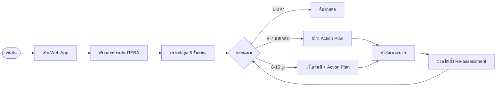
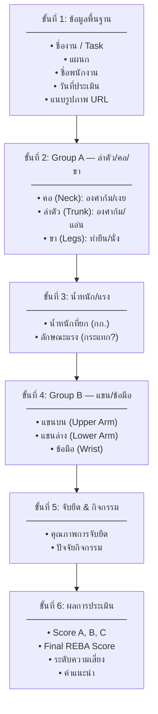
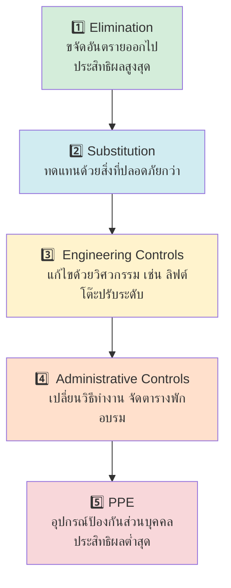
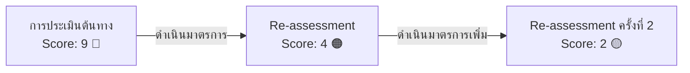

# คู่มือการใช้งาน ระบบประเมินความเสี่ยงการยศาสตร์ REBA

**สำหรับ:** เจ้าหน้าที่ความปลอดภัยในการทำงาน (จป.ว.) และหัวหน้างาน  
**เวอร์ชัน:** 1.0 | **วันที่:** เมษายน 2569

---

## ภาพรวมระบบ



---

## การเข้าใช้งาน

เปิด browser แล้วไปที่ URL ที่ได้รับจากผู้ดูแลระบบ เช่น:
```
https://script.google.com/macros/s/XXXXXXXXXXXXXXXX/exec
```

> ต้อง Login ด้วย Google Account ที่ได้รับสิทธิ์เข้าใช้งาน

---

## หน้า Dashboard

แสดงภาพรวมการประเมินทั้งหมดขององค์กร

| ส่วน | รายละเอียด |
|------|-----------|
| สถิติสรุป | จำนวนการประเมิน, จำนวนที่เสี่ยงสูง, Action Plan ค้างอยู่ |
| กราฟกระจายความเสี่ยง | สัดส่วนแต่ละระดับความเสี่ยง |
| แนวโน้มรายเดือน | จำนวนและคะแนนเฉลี่ย 6 เดือนล่าสุด |
| งานที่เสี่ยงสูงสุด | Top 5 งาน/ตำแหน่ง |
| การประเมินล่าสุด | 5 รายการล่าสุด |

---

## การสร้างการประเมิน REBA



---

## ระดับความเสี่ยง REBA

| คะแนน | ระดับ | สี | การดำเนินการ |
|-------|-------|-----|-------------|
| 1 | ไม่มีความเสี่ยง | 🟢 เขียว | ไม่จำเป็นต้องดำเนินการ |
| 2–3 | ความเสี่ยงต่ำ | 🟡 เหลืองอ่อน | อาจต้องเปลี่ยนแปลง |
| 4–7 | ความเสี่ยงปานกลาง | 🟠 เหลือง | ต้องสืบสวนและดำเนินการเร็วๆ นี้ |
| 8–10 | ความเสี่ยงสูง | 🔴 ส้ม | ต้องสืบสวนและดำเนินการแก้ไข |
| 11–15 | ความเสี่ยงสูงมาก | 🔴 แดง | ต้องดำเนินการแก้ไขทันที |

---

## การสร้าง Action Plan

หลังได้ผลการประเมิน กด **"เพิ่ม Action Plan"** แล้วระบุ:

| ฟิลด์ | รายละเอียด |
|-------|-----------|
| ประเภทมาตรการ | เลือกตาม Hierarchy of Controls (ดูด้านล่าง) |
| รายละเอียดมาตรการ | อธิบายสิ่งที่จะทำ |
| ผู้รับผิดชอบ | ชื่อบุคคล/แผนก |
| กำหนดเสร็จ | วันที่ต้องดำเนินการเสร็จ |

### Hierarchy of Controls (ลำดับความสำคัญ)



---

## การประเมินซ้ำ (Re-assessment)

ใช้เพื่อตรวจสอบว่ามาตรการที่ดำเนินการแล้วช่วยลดความเสี่ยงได้จริง



**วิธีสร้าง Re-assessment:**
1. เปิดการประเมินต้นทาง
2. กด **"ประเมินซ้ำ (Re-assessment)"**
3. กรอกค่าใหม่ตามสภาพงานที่แก้ไขแล้ว
4. ระบบจะเชื่อมโยงและแสดงผลเปรียบเทียบอัตโนมัติ

---

## รายงาน

| รายงาน | วิธีเข้าถึง |
|--------|-----------|
| ผลการประเมินรายครั้ง | เปิดการประเมิน → ดู Score และคำแนะนำ |
| สถานะ Action Plan | เมนู "Action Plans" |
| Dashboard ภาพรวม | หน้าแรก |

---

## สิทธิ์การใช้งาน

| Role | สิ่งที่ทำได้ |
|------|------------|
| **Admin** | จัดการ user, ดูทุกอย่าง |
| **Safety Officer (จป.ว.)** | สร้าง/แก้ไขการประเมิน, Action Plan |
| **Supervisor** | ดูรายงาน, Dashboard |
| **Executive** | ดู Dashboard เท่านั้น |

---

## คำถามที่พบบ่อย

**Q: ลืมบันทึก ข้อมูลหายไหม?**  
A: ระบบมีปุ่ม "บันทึก Draft" สามารถกลับมากรอกต่อได้ ยังไม่ submit จะยังไม่ lock

**Q: แก้ไขผลการประเมินได้ไหม?**  
A: ไม่ได้ครับ เพื่อความน่าเชื่อถือของข้อมูล ถ้าต้องการแก้ต้องสร้าง Re-assessment ใหม่

**Q: ใช้บนมือถือได้ไหม?**  
A: เวอร์ชันปัจจุบัน (POC) รองรับ desktop เป็นหลัก มือถือวางแผนไว้ใน Phase 2
