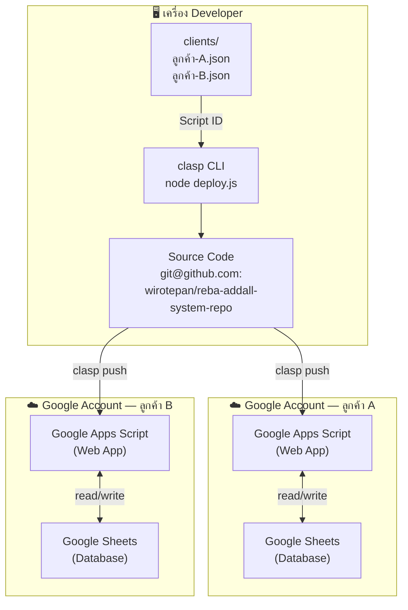
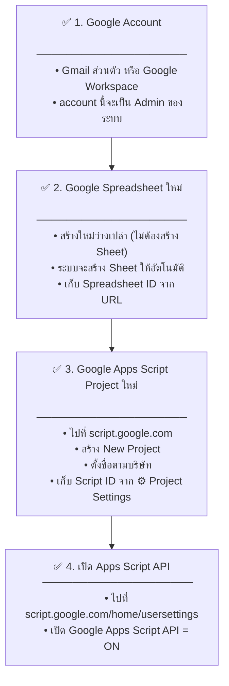
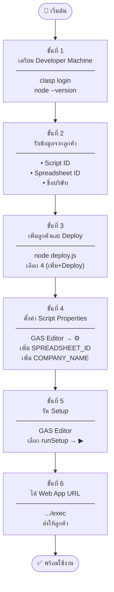
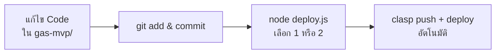

# คู่มือการ Deploy ระบบ REBA สำหรับลูกค้าใหม่

**สำหรับ:** Developer / System Admin  
**เวอร์ชัน:** 1.0 | **วันที่:** เมษายน 2569

---

## ภาพรวมสถาปัตยกรรม



---

## สิ่งที่ลูกค้าต้องเตรียม



### วิธีหา Spreadsheet ID

```
URL: https://docs.google.com/spreadsheets/d/[SPREADSHEET_ID]/edit
                                              ↑↑↑↑↑↑↑↑↑↑↑↑↑↑↑
ตัวอย่าง: 1FzQvx4e8G7V2vDiwqH2ognimeJV0UCGGc8RRpaeozM4
```

### วิธีหา Script ID

```
GAS Editor → ⚙️ Project Settings → Script ID
ตัวอย่าง: 1_LwyqR26dXhOnx4RJ2m-EGwrjyzR9JLnj7EAgxKu4TLjVma0p3NHmGRu
```

---

## ขั้นตอนการ Deploy (ครั้งแรก)



---

## รายละเอียดแต่ละขั้นตอน

### ขั้นที่ 1 — เตรียม Developer Machine (ครั้งแรกครั้งเดียว)

```bash
# ติดตั้ง clasp
npm install -g @google/clasp

# Login Google Account ของ Developer
clasp login
# → browser เปิดขึ้น → Login → Allow
```

---

### ขั้นที่ 2 — รับข้อมูลจากลูกค้า

รวบรวมข้อมูลต่อไปนี้จากลูกค้า:

| ข้อมูล | ตัวอย่าง | วิธีหา |
|--------|---------|--------|
| ชื่อบริษัท | บริษัท ABC จำกัด | — |
| Script ID | `1_LwyqR26...` | GAS Editor → ⚙️ |
| Spreadsheet ID | `1FzQvx4e...` | Sheets URL |
| ผู้ติดต่อ | คุณสมชาย 081-xxx | — |

---

### ขั้นที่ 3 — Deploy ด้วย deploy.js

```bash
cd "d:/WORKSPACE/addall/software/REBA"
node deploy.js
```

เลือก **4 (เพิ่มลูกค้าใหม่ + Deploy ทันที)** แล้วกรอกข้อมูล:

```
ชื่อบริษัท/ลูกค้า: บริษัท ABC จำกัด
Script ID: 1_LwyqR26...
Spreadsheet ID: 1FzQvx4e...
ผู้ติดต่อ: คุณสมชาย
```

ระบบจะ:
1. บันทึก config ไว้ใน `clients/` 
2. สร้าง `.clasp.json` 
3. รัน `clasp push` อัตโนมัติ
4. สร้าง deployment version ใหม่

---

### ขั้นที่ 4 — ตั้งค่า Script Properties

ใน GAS Editor ของลูกค้า:

```
⚙️ Project Settings → Script Properties → เพิ่มพร็อพเพอร์ตี้
```

| พร็อพเพอร์ตี | ค่า |
|-------------|-----|
| `SPREADSHEET_ID` | Spreadsheet ID ของลูกค้า |
| `COMPANY_NAME` | ชื่อบริษัทลูกค้า |

---

### ขั้นที่ 5 — รัน runSetup

ใน GAS Editor:

```
1. คลิก Code.gs ในแถบซ้าย
2. Dropdown บน toolbar → เลือก runSetup
3. กด ▶ เรียกใช้
4. อนุมัติ permission (ครั้งแรกเท่านั้น)
5. รอจน Execution log แสดง "Setup เสร็จสมบูรณ์"
```

**ผลลัพธ์:** Google Sheets จะมี 4 Sheet ใหม่:
- `Users`
- `Assessments`
- `ActionPlans`
- `AuditLog`

---

### ขั้นที่ 6 — รับ Web App URL

```bash
# ดู deployments ทั้งหมด
clasp deployments
```

URL สำหรับใช้งาน:
```
https://script.google.com/macros/s/[DEPLOYMENT_ID]/exec
```

**ส่ง URL นี้ให้ลูกค้า** พร้อมแนะนำให้ Bookmark ไว้

---

## การ Deploy ครั้งถัดไป (อัปเดต Code)



```bash
# Deploy ลูกค้าคนเดียว
node deploy.js → เลือก 1 → เลือกลูกค้า

# Deploy ทุกลูกค้าพร้อมกัน
node deploy.js → เลือก 2
```

> **หมายเหตุ:** ลูกค้าไม่ต้องทำอะไรเพิ่ม ระบบอัปเดตอัตโนมัติ

---

## Checklist ก่อนส่งมอบลูกค้า

```
□ Script Properties ตั้งค่าครบ (SPREADSHEET_ID, COMPANY_NAME)
□ runSetup รันสำเร็จ — Sheets 4 ชีทสร้างแล้ว
□ เปิด Web App URL ได้ (ไม่มี error)
□ Login ด้วย Google Account ของลูกค้าได้
□ สร้างการประเมินทดสอบ 1 รายการได้
□ ส่ง URL และคู่มือ (client-guide.md) ให้ลูกค้า
```

---

## แก้ปัญหาที่พบบ่อย

| ข้อผิดพลาด | สาเหตุ | วิธีแก้ |
|-----------|--------|--------|
| `The caller does not have permission` | ยังไม่ได้ `clasp login` หรือ Apps Script API ปิดอยู่ | `clasp login` + เปิด API ที่ script.google.com/home/usersettings |
| `CONFIG is not defined` | ไฟล์โหลดผิดลำดับ (เกิดจาก GAS เวอร์ชันเก่า) | `clasp push --force` แล้ว `clasp deploy` ใหม่ |
| `SPREADSHEET_ID ยังไม่ได้ตั้งค่า` | ลืมตั้ง Script Properties | ทำขั้นที่ 4 ซ้ำ |
| `Sheet not found — กรุณารัน runSetup()` | ยังไม่ได้รัน Setup | ทำขั้นที่ 5 ซ้ำ |
| `doGet not found` | ไฟล์เก่าค้างใน GAS หรือ executeAs ผิด | `clasp push --force` + `clasp deploy` ใหม่ |

---

## โครงสร้างไฟล์ทั้งหมด

```
REBA/
├── gas-mvp/                    ← Source code (push ขึ้น GAS)
│   ├── 01_Config.gs            ← ค่าคงที่, risk labels, recommendations
│   ├── 02_Db.gs                ← Sheets helper + CacheService
│   ├── 03_Auth.gs              ← Google session, RBAC
│   ├── 04_RebaEngine.gs        ← REBA calculation engine (Table A/B/C)
│   ├── 05_ActionPlanService.gs ← Action plan CRUD
│   ├── 06_AssessmentService.gs ← Assessment CRUD + re-assessment
│   ├── 07_DashboardService.gs  ← Dashboard aggregation
│   ├── 08_SetupService.gs      ← Sheet initialization
│   ├── Code.gs                 ← doGet(), client API endpoints
│   ├── index.html              ← SPA frontend (Bootstrap 5)
│   └── appsscript.json         ← GAS manifest
│
├── clients/                    ← Config ต่อลูกค้า (ไม่มี secret)
│   ├── template.json
│   └── [ชื่อลูกค้า].json
│
├── docs/
│   ├── client-guide.md         ← คู่มือลูกค้า (ไฟล์นี้)
│   └── deployment-guide.md     ← คู่มือ deploy
│
├── deploy.js                   ← Multi-client deploy tool
├── deploy.bat                  ← Windows shortcut
└── .gitignore
```

---

## ข้อมูลลูกค้าที่ Deploy แล้ว

| ลูกค้า | วันที่ Deploy | Web App URL | สถานะ |
|--------|-------------|-------------|-------|
| reba-addall-system | 2026-04-15 | [ดูใน clients/reba-addall-system.json] | ✅ Active |

> อัปเดตตารางนี้ทุกครั้งที่ deploy ลูกค้าใหม่
